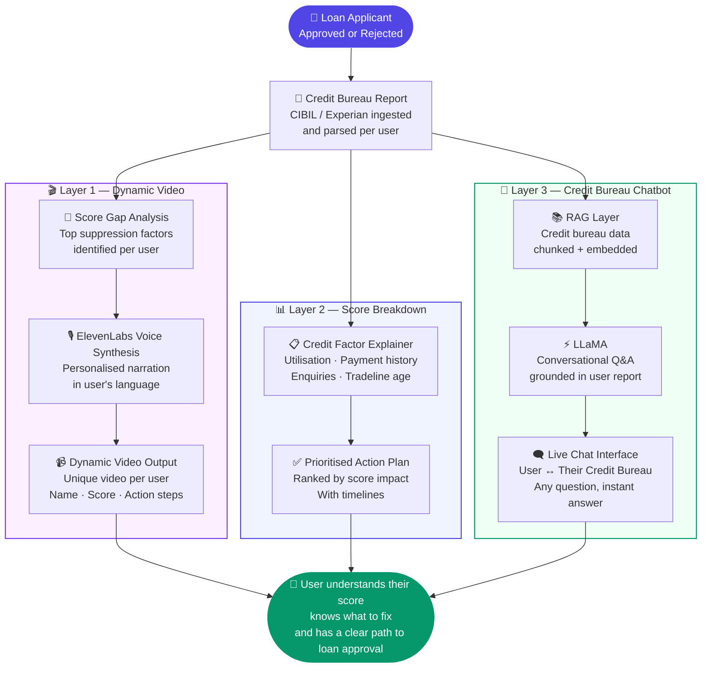

# 💳 AI Credit Assist Platform
### RAG + LLM + Dynamic Video | Chat With Your Credit Bureau | 500K+ Users

---

## 🧩 The Problem

Every year, millions of loan applications get rejected in India — and almost no one is told why.

Banks and NBFCs don't explain rejections clearly. Credit bureau reports exist but are dense, technical, and unreadable for most users. The result: rejected applicants feel helpless, frustrated, and have no clear path forward.

For a fintech lender, this creates two compounding problems:

- **Customer experience breaks down** at the worst possible moment — rejection. NPS tanks, complaints rise, and brand trust erodes.
- **Recoverable customers are lost permanently.** A large portion of rejected applicants could qualify for a loan within 60–90 days with the right interventions — but without guidance, they never come back.

The gap wasn't in credit policy. It was in **customer understanding**.

---

## 💡 The Solution

**Credit Assist** — an AI platform that turns a loan rejection into a guided credit improvement journey.

Instead of a rejection dead-end, customers get a personalised experience across three layers:

**1. Dynamic Personalised Video**
Every user gets a unique AI-generated video — their name, their specific credit issues, their improvement steps — narrated in their own language using ElevenLabs voice synthesis. Not a generic explainer. A video made for them.

**2. Credit Score Breakdown**
A clear, jargon-free breakdown of the major factors suppressing their score — utilisation, payment history, enquiries, tradeline age — with prioritised action steps for each.

**3. Credit Bureau Chatbot**
The centrepiece of the product. A RAG + LLaMA powered chatbot that lets users have a real conversation with their own credit bureau data. Ask anything. Get personalised, accurate answers grounded in their actual report.

> *"Why is my score low?"*
> *"How many loans are outstanding on my name?"*
> *"What should I fix first to get approved faster?"*
> *"If I clear this overdue, how much will my score improve?"*

This is not generic credit advice. Every answer is derived from the user's own credit bureau data.

---

## 🏗️ System Flow

---

## 📋 What Users Can Ask the Chatbot

The credit bureau chatbot is grounded entirely in the user's own report. Some examples of real queries it handles:

| User Question | How It's Answered |
|--------------|-------------------|
| *"Why is my credit score low?"* | RAG retrieves user's specific negative factors, LLaMA explains in plain language |
| *"How many loans are active on my name?"* | Pulled directly from parsed bureau data |
| *"What should I fix first?"* | LLaMA ranks factors by score impact based on user's report |
| *"If I clear this overdue, will my score improve?"* | Contextual answer grounded in bureau scoring logic |
| *"How long will it take to reach 750?"* | Timeline estimate based on user's specific gaps |

---

## 📊 Results

| Metric | Outcome |
|--------|---------|
| Users served | **500,000+** |
| Rejected applicants who returned and got approved | **30–40%** |
| Customer satisfaction (rejected applicants) | **Up 30%** |
| Support call reduction | Significant — chatbot resolved majority of credit queries |
| Previous experience for rejected users | Dead-end rejection with no guidance |
| New experience | Personalised video + action plan + live chat with their data |

---

## 🔑 Key Product Learnings

**1. The rejection moment is the highest-leverage product touchpoint**
Most fintech products focus on the approved user journey. The rejected user is underserved and undervalued — but they're also the most motivated to engage. Credit Assist turned the worst moment in the customer relationship into a retention and re-engagement opportunity.

**2. Personalisation at the video layer changed emotional response**
Generic explainer videos performed poorly in testing. When users saw their own name, their own score, and their own specific issues narrated back to them, engagement and completion rates jumped significantly. ElevenLabs voice synthesis was the enabling technology — it made per-user video economically viable at scale.

**3. RAG over a single user's data is a different design problem than RAG over a knowledge base**
Most RAG implementations retrieve from a shared corpus. Here, each user's credit bureau report is their own isolated retrieval context. This required a per-user chunking and embedding strategy, and careful prompt design to prevent the LLM from generalising beyond what the report actually says.

**4. The chatbot reduced support load as a side effect, not a goal**
We built the chatbot to improve user understanding — support deflection was a secondary benefit. Because users could now get accurate, personalised answers instantly, they stopped calling support to ask credit-related questions. The product solved the upstream problem.

**5. 30–40% re-approval rate validates the core thesis**
The product was built on a hypothesis: rejected applicants can become approved applicants with the right guidance. A 30–40% return-and-approval rate at 500K+ user scale is direct validation that the hypothesis was correct and the intervention worked.

---

## 🛠️ Tech Stack

| Layer | Tool / Approach |
|-------|----------------|
| Credit Data Parsing | Bureau report ingestion + structured extraction |
| Dynamic Video | ElevenLabs voice synthesis + personalised video generation |
| RAG Layer | Per-user credit report chunking + embeddings |
| LLM | LLaMA (conversational Q&A grounded in user data) |
| Chat Interface | Real-time conversational UI |
| Score Breakdown | Rule-based factor analysis + LLM explanation layer |

---

## 🧠 Built By

**Akshay Seth** — AI-Native Product Manager | AVP Product @ PayMe
[LinkedIn](https://www.linkedin.com/in/akshay-seth-1b7a1668/) · [Blog](https://www.decodeai.in) · [GitHub](https://github.com/akshayequity-pixel)
