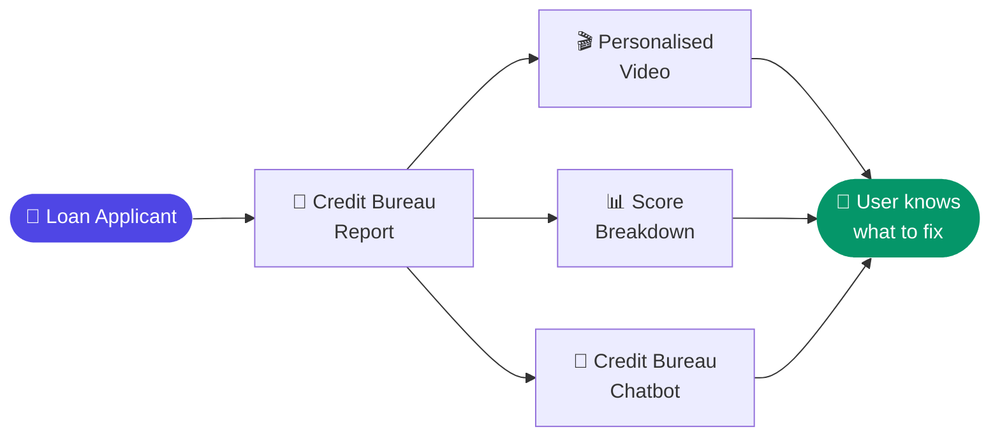

# 💳 AI Credit Assist Platform
### RAG + LLM + Dynamic Video | Chat With Your Credit Bureau | 500K+ Users

---

## 🧩 The Problem

Every year, millions of loan applications get rejected in India — and almost no one is told why.

Banks and NBFCs don't explain rejections clearly. Credit bureau reports exist but are dense, technical, and unreadable for most users. The result: rejected applicants feel helpless, have no clear path forward, and never come back.

For a fintech lender, this creates two compounding problems:

- **Customer experience breaks down** at the worst possible moment. NPS tanks, complaints rise.
- **Recoverable customers are lost permanently.** A large portion of rejected applicants could qualify within 60–90 days with the right guidance — but without it, they walk away.

The gap wasn't in credit policy. It was in **customer understanding**.

---

## 💡 The Solution

**Credit Assist** — an AI platform that turns a loan rejection into a guided credit improvement journey, delivered across three layers.

---

## 🏗️ How It Works

---

## 📋 The Three Layers

**🎬 Layer 1 — Dynamic Personalised Video**
Every user receives a unique AI-generated video with their name, their specific credit issues, and their improvement steps — narrated in their own language via ElevenLabs voice synthesis. Not a generic explainer. A video made for them.

**📊 Layer 2 — Credit Score Breakdown**
A jargon-free breakdown of the exact factors suppressing their score — payment history, utilisation, enquiries, tradeline age — with prioritised action steps ranked by impact.

**💬 Layer 3 — Credit Bureau Chatbot**
The centrepiece. A RAG + LLaMA chatbot that lets users have a real conversation with their own credit bureau data. Every answer is grounded in their actual report — not generic advice.

> *"Why is my score low?"*
> *"How many loans are active on my name?"*
> *"What should I fix first to get approved faster?"*

---

## 📊 Results

| Metric | Outcome |
|--------|---------|
| Users served | **500,000+** |
| Rejected applicants re-approved after using Credit Assist | **30–40%** |
| Customer satisfaction (rejected applicants) | **Up 30%** |
| Support call reduction | Significant — chatbot resolved majority of credit queries |

---

## 🔑 Key Product Learnings

**1. The rejection moment is the highest-leverage touchpoint**
Most fintech products focus on the approved user journey. The rejected user is underserved — but also the most motivated to engage. Credit Assist turned the worst moment in the customer relationship into a re-engagement opportunity.

**2. Personalisation changed emotional response**
Generic explainer videos performed poorly in testing. When users saw their own name, their own score, and their specific issues narrated back to them, engagement jumped significantly. Per-user video was made economically viable at scale by ElevenLabs.

**3. RAG on a single user's data is a different design problem**
Most RAG implementations retrieve from a shared corpus. Here, each user's credit bureau report is their own isolated retrieval context — requiring a per-user chunking and embedding strategy.

**4. 30–40% re-approval validates the core thesis**
The product was built on a hypothesis: rejected applicants can become approved applicants with the right guidance. A 30–40% return-and-approval rate at 500K+ scale is direct proof it worked.

---

## 🛠️ Tech Stack

| Layer | Tool / Approach |
|-------|----------------|
| Dynamic Video | ElevenLabs voice synthesis + personalised video generation |
| RAG Layer | Per-user credit report chunking + embeddings |
| LLM | LLaMA (conversational Q&A grounded in user data) |
| Score Breakdown | Factor analysis + LLM explanation layer |

---

## 🧠 Built By

**Akshay Seth** — AI-Native Product Manager | AVP Product @ PayMe
[LinkedIn](https://www.linkedin.com/in/akshay-seth-1b7a1668/) · [Blog](https://www.decodeai.in) · [GitHub](https://github.com/akshayequity-pixel)
